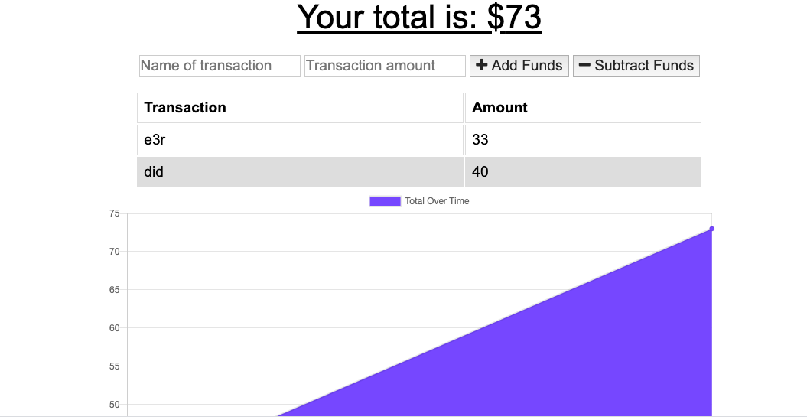
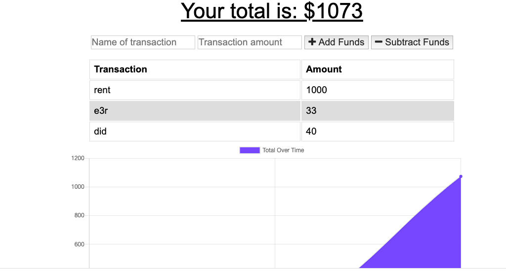

## -Progressive-Budget

The user will be able to add expenses and deposits to their budget with or without a connection. When entering transactions offline, they should populate the total when brought back online.

Online: 



Offline:



## Acceptance Criteria

GIVEN a user is on Budget App without an internet connection
WHEN the user inputs a withdrawal or deposit
THEN that will be shown on the page, and added to their transaction history when their connection is back online.


Offline Functionality:

  * Enter deposits offline

  * Enter expenses offline

When brought back online:

  * Offline entries should be added to tracker.


## Deployed app:   https://young-cliffs-06002.herokuapp.com/
            
## Table of Contents
            
* [Installation](#Installation)
* [Usage](#Usage)  
* [License](#License)         
        
## Installation
            
**Step 1 - Clone my repo using the command line below.**
```
git clone https://github.com/Antidetka/-Progressive-Budget
```
**Step 2 - Change directory to the cloned repo folder.**
```
cd -Progressive-Budget
```
**Step 3 - Install all required NPM packages.**
```
npm install express mongoose morgan lite-server compression
```
**Step 4 - Start the application server using the command line below**
```
npm start

```            
## Usage
            
npm start
 
## License
            
MIT
               
## Questions
            
[](https://www.github.com/Antidetka) | 
[](mailto:musovirova@yahoo.com)